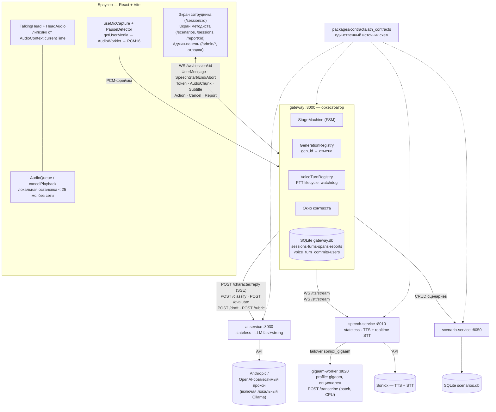
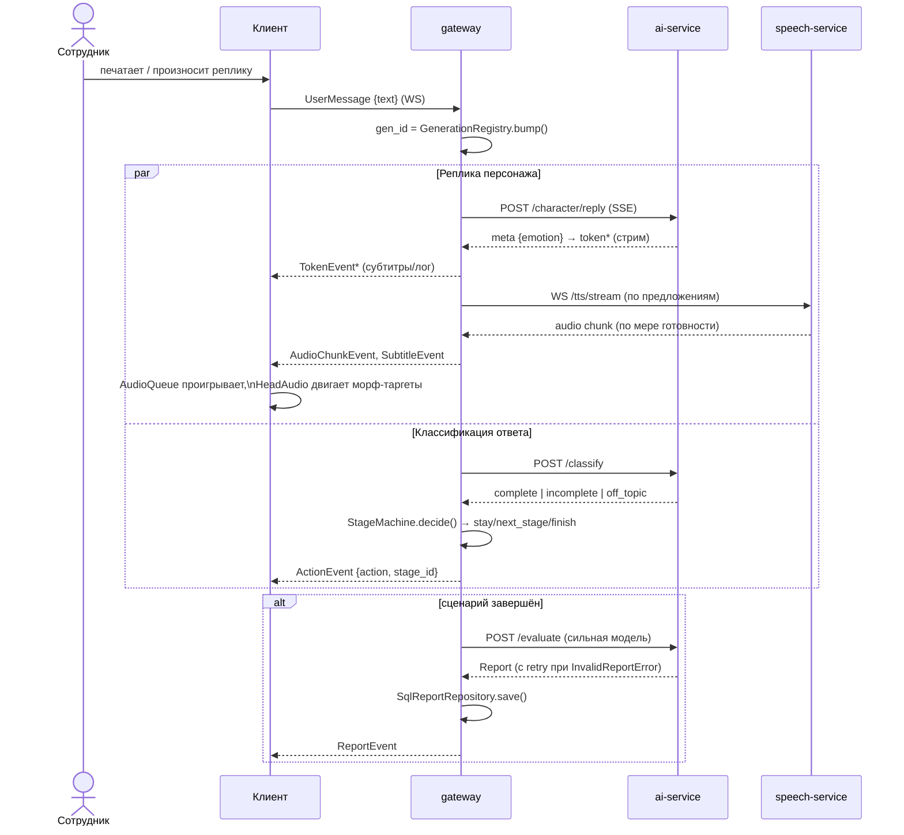
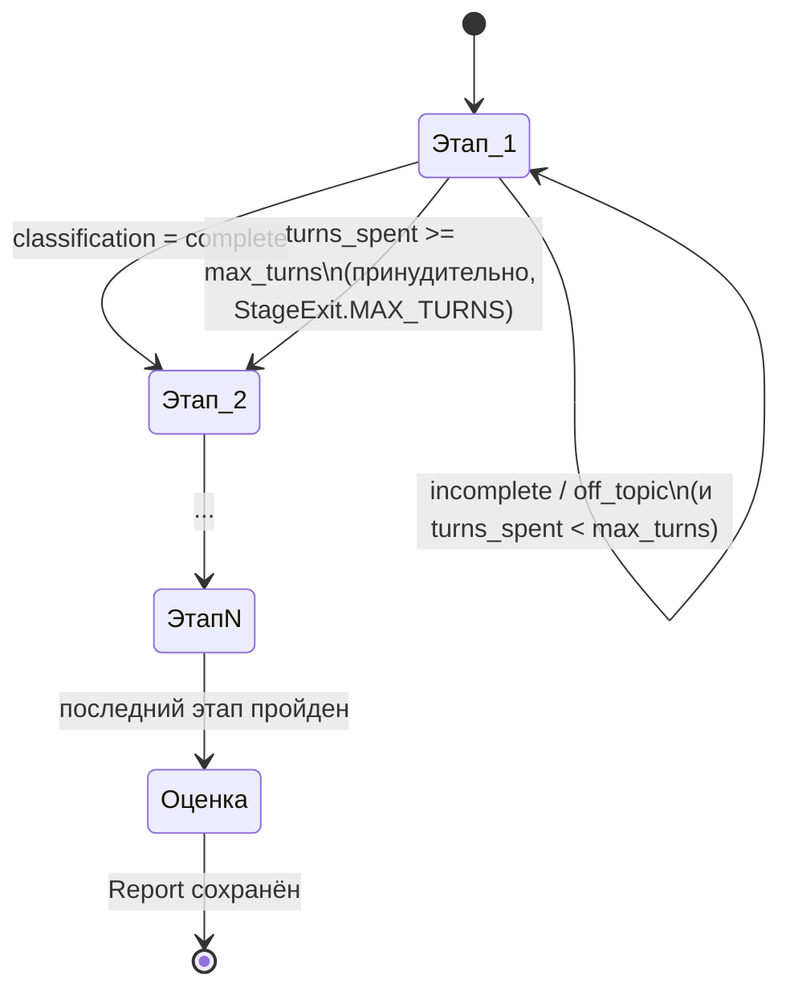
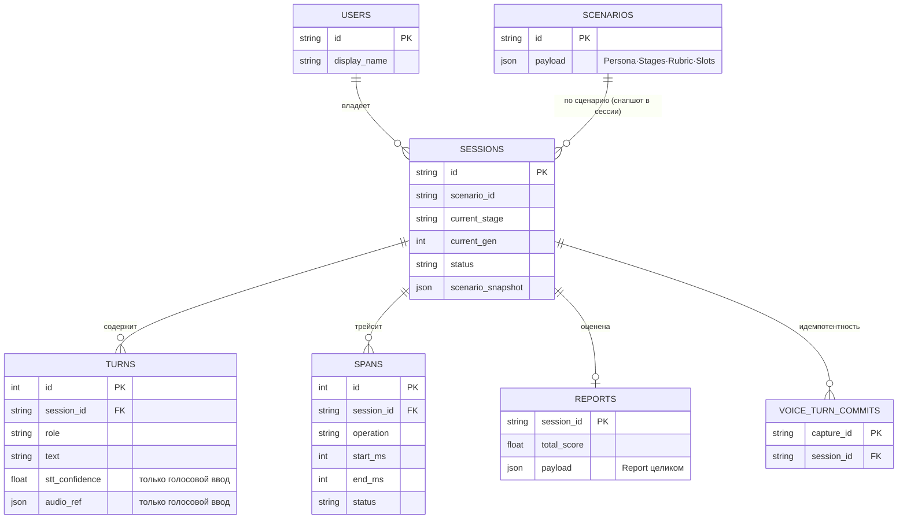

# Архитектура и фичи — актуальный срез

Внешний обзорный документ (Mermaid-диаграммы + список фич) — не заменяет
внутренние документы по отдельным темам, а даёт карту сверху:
[`docs/architecture.md`](architecture.md) (поток одного хода в деталях),
[`docs/contracts.md`](contracts.md) (форма данных),
[`docs/data.md`](data.md) (хранение),
[`docs/latency-budget.md`](latency-budget.md) (метрики),
[`docs/stt-phase.md`](stt-phase.md) (голосовой ввод — план и статус).

Источник фактов — `origin/main` на момент написания (HEAD `d42c2d0`, merge
`feature/vincent-avatar-rebased`).

---

## 1. Компоненты системы



**Провайдеры и заглушки.** `LLM_PROVIDER = mock | anthropic | openai_compatible`,
`TTS_PROVIDER = mock | soniox | ...`, `STT_PROVIDER = mock | soniox | gigaam |
soniox_gigaam`. По умолчанию везде `mock` — стек поднимается и проходит
health-check без единого ключа. `gigaam-worker` живёт за отдельным
docker-compose профилем `gigaam` и не поднимается сам по себе.

---

## 2. Поток одного хода (текст)



**Инвариант отмены.** Каждый артефакт хода несёт `gen_id`. Единая точка
выхода `_send()` в `pipeline.py` сверяет `gen_id` с текущим поколением и
молча гасит событие устаревшего — это и есть «ноль возвратов отменённого
хвоста» (метрика 4), а не результат гонки таймаутов.

---

## 3. Барж-ин (перебивание) — голосовой ввод

```mermaid
sequenceDiagram
    actor E as Сотрудник
    participant C as Клиент (Mic/PauseDetector)
    participant G as gateway (VoiceTurnRegistry)
    participant S as speech-service (WS /stt/stream)

    Note over C: Персонаж говорит, микрофон слушает
    E->>C: начинает говорить (PTT)
    C->>C: cancelPlayback() — локально, < 25 мс
    C->>G: SpeechStart {interrupts: gen_id_old}
    G->>G: gen_id = bump(); cancel(gen_id_old)
    G-->>C: CancelEvent {gen_id_old}
    C->>G: PCM-фреймы (WS, потоково)
    G->>S: релей PCM → STT-провайдер
    S-->>G: TranscriptEvent {partial}* → {final}
    Note over G: FailoverSttProvider:\nSoniox основной, GigaAM — fallback
    E->>C: отпускает PTT / пауза
    C->>G: SpeechEnd
    G->>G: PauseDetector (клиент) уже подтвердил тишину;\nVoiceTurnRegistry финализирует
    G->>G: pipeline.handle_voice_final(text) → обычный ход
```

**Честно про VAD.** Это push-to-talk с локальным энергетическим
`PauseDetector` (RMS-порог + гистерезис) для автозавершения уже начатой
записи — не свободный onset-VAD. `useVad.ts` (Silero WASM, мгновенный
onset-барж-ин без удержания кнопки) описан интерфейсом, но не реализован
(`throw new Error('[STT] not implemented')`) — см. §7.

---

## 4. Конечный автомат этапов



Классифицирует ответ LLM (`complete | incomplete | off_topic`), но **решение
о переходе принимает код** (`StageMachine.decide` в `fsm.py`) — модель не
может самовольно перепрыгнуть или пропустить этап методики.

---

## 5. Данные



`gateway` и `scenario-service` держат каждый свою SQLite-базу (own-DB на
сервис, без общей схемы) — сценарий копируется в сессию снапшотом на
момент старта, поэтому правка рубрики методистом задним числом не меняет
уже пройденные отчёты.

---

## 6. Список фич

### Сотрудник (тренировка)
- Диалог с персонажем текстом или голосом (push-to-talk).
- Потоковая озвучка ответа по предложениям, не дожидаясь полной генерации.
- Липсинк и субтитры, синхронные с фактически звучащим аудио.
- Перебивание персонажа — текстом мгновенно (Enter), голосом через PTT +
  локальный `PauseDetector`.
- Индикатор состояния: слушаю / думает / говорит.
- Прогресс по этапам сценария в шапке.
- Согласие на запись голоса — баннер в UI (`ConsentBanner`).

### Методист
- Библиотека сценариев: список, запуск, редактирование, копирование,
  удаление.
- Редактор сценария: персона (имя/роль/манера/настроение/сложность/голос),
  брифинг, слоты-подстановки с валидацией, этапы (цель/открывающая
  реплика/критерий завершения/лимит ходов), рубрика (критерий/шкала/вес).
- ИИ-черновик сценария по короткому брифу и ИИ-черновик рубрики по уже
  заполненным этапам — экономят методисту первый проход.
- Превью сценария перед запуском (что увидит сотрудник).
- Журнал сессий с статусами и переход к отчёту.
- Отчёт: вердикт, итоговый балл, баллы по критериям с дословной цитатой,
  индикатор уверенности распознавания голоса, счётчик освобождённых часов.
- Явная плашка в UI, если отчёт посчитан LLM-заглушкой, а не настоящей
  моделью — методист не примет фейковую оценку за настоящую.

### Голосовой ввод (детали см. §3)
- Realtime STT по WS (`speech-service`, провайдер Soniox).
- Локальный self-hosted STT воркер (GigaAM, CPU, офлайн после
  предзагрузки весов) как альтернатива или fallback.
- Автоматический failover Soniox → GigaAM в рамках одного хода
  (`soniox_gigaam`), с уведомлением клиента (`VoiceProviderSwitchedEvent`).
- Партиальные транскрипты в UI до финализации.
- `stt_confidence` и `audio_ref` в каждом голосовом ходе — под точечное
  прослушивание цитаты в отчёте, без прослушивания записи целиком.

### Оценка и надёжность
- Итоговая оценка сильной моделью, один вызов после завершения.
- Проверка каждой цитаты как дословной подстроки реплики сотрудника —
  отчёт с пересказом вместо цитаты не проходит и не показывается методисту.
- Проверка покрытия рубрики (каждый критерий оценён ровно один раз).
- Ручной пересчёт отчёта методистом (`POST /sessions/{id}/report`) — на
  случай, если первая оценка упала или посчиталась на заглушке.

### Наблюдаемость / отладка
- Админ-панель (`/admin/*`, вне ролей продукта): путь сессии по ходам,
  Gantt-график операций конвейера одного хода.
- Дашборд нагрузки: вызовы по downstream-сервисам, средняя/p95 латентность
  по операциям, ошибки и отмены, таймлайны активности.
- `EmotionLab` — отдельный стенд для ручной проверки голос×эмоция×аватар в
  обход тренировочного сценария.

### Инженерные инварианты (не фичи для пользователя, но часть контракта)
- `gen_id` на каждом артефакте хода — единственный разрешённый путь наружу
  (`_send()`) отбрасывает события устаревшего поколения.
- Часы мимики и субтитров — исключительно `AudioContext.currentTime`,
  никаких независимых таймеров (закреплено ESLint-правилом на
  `src/audio/**` и `src/avatar/**`).
- Переход между этапами решает код (FSM), а не LLM.
- `packages/contracts` — общий пакет типов, импортируемый всеми сервисами;
  рассинхрон схем ловится на импорте, а не в рантайме.

---

## 7. Что не реализовано / известные ограничения

| Область | Статус | Что именно |
|---|---|---|
| Клиентский VAD (барж-ин без удержания кнопки) | не реализовано | `useVad.ts` — интерфейс есть, тело кидает `not implemented`. Сейчас барж-ин голосом — только PTT + `PauseDetector` |
| RAG / база знаний | не реализовано | Ни в контрактах, ни в API `origin/main` нет узнаваемых следов — сценарии не подключают внешние документы |
| Postgres | не реализовано | Блок сервиса в `docker-compose.yml` закомментирован; `db/repositories.py` уже абстрагирован под переезд |
| Персист хода при обрыве | частично | Запись хода в БД происходит на disconnect, не сразу после ответа — при падении процесса до дисконнекта разговор теряется |
| Сжатие вытесненного контекста | заглушка | `context_window.summarize_evicted` возвращает прежнюю сводку без вызова LLM — признанно безвредно для сценариев ≤4 этапов |
| Фонетика липсинка | не проверено | Модель визем (`model-en-mixed.bin`) обучена на английской фонетике, точность на русской речи не измерялась |
| Аутентификация | вне скоупа | Осознанно — по условиям кейса роли не авторизуются |

---

## 8. Ключевые инженерные решения (кратко, «почему»)

- **3D-аватар в браузере, а не облачное видео** (TalkingHead + HeadAudio,
  MIT) — нулевая задержка до первого кадра и локальная остановка на
  барж-ине вместо разрыва видеопотока; размен — персонаж стилизованный, не
  фотореалистичный (вне скоупа кейса, заодно снимает вопрос согласия на
  использование внешности реального человека).
- **Один воркер uvicorn у gateway** — `GenerationRegistry` живёт в памяти
  процесса; второй воркер развёл бы `gen_id` между соединениями и сломал
  инвариант отмены незаметно, под нагрузкой, которой не будет на демо.
- **STT — provider-agnostic с failover**, а не жёсткая привязка к одному
  вендору — `soniox_gigaam` переключается в рамках одного хода без разрыва
  сессии, а `gigaam-worker` даёт офлайн-путь на случай недоступности API.
- **Оценка — единственный вызов сильной модели**, с проверкой цитат кодом,
  а не доверием к промпту: без этого «каждый балл проверяем за 10 секунд»
  — из продуктовой гипотезы превращается в лозунг.
